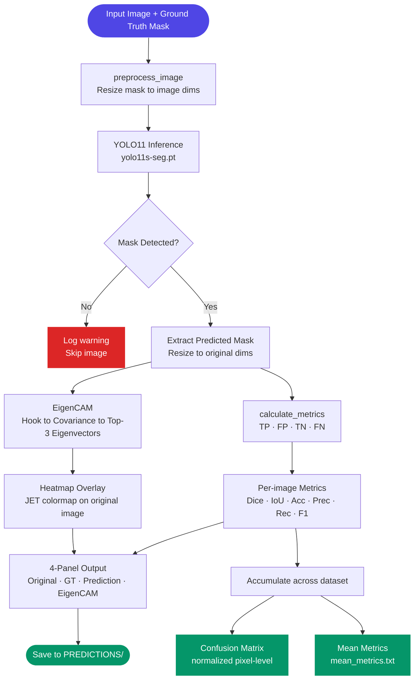

# 🧠 YOLO11-based Brachial Plexus Segmentation with Explainable AI


> **One-liner:** An instance segmentation pipeline that localises the brachial plexus in medical images using YOLO11, with per-prediction explainability via a custom EigenCAM implementation.

---

## 📌 Table of Contents

- [The Problem](#-the-problem)
- [Our Solution & Purpose](#-our-solution--purpose)
- [Why This Over Others](#-why-this-over-others)
- [Tech Stack](#-tech-stack)
- [System Flow](#-system-flow)
- [File Structure](#-file-structure)
- [Prerequisites](#-prerequisites)
- [Installation & Setup](#-installation--setup)
- [Usage](#-usage)
- [Configuration](#-configuration)
- [Screenshots](#-screenshots)
- [Contribution Guidelines](#-contribution-guidelines)
- [Known Limitations & Roadmap](#-known-limitations--roadmap)
- [License](#-license)

---

## 🚨 The Problem

The brachial plexus — a network of nerves running from the spine through the shoulder — is a critical anatomical structure in regional anaesthesia, orthopaedic surgery, and trauma care. Accurate, real-time segmentation of this structure from ultrasound or MRI images is essential for safe needle guidance and surgical planning. However:

**Key pain points:**
- ⚠️ **Manual annotation is slow and expert-dependent** — delineating the brachial plexus requires specialist knowledge and is a bottleneck in clinical workflows.
- ⚠️ **Existing deep learning models are black boxes** — clinicians cannot trust or audit model predictions without understanding *why* a region was segmented.
- ⚠️ **No unified evaluation standard** — most research reports only Dice or IoU in isolation, making model comparison across papers unreliable.

---

## 🎯 Our Solution & Purpose

**YOLO11-based Brachial Plexus Segmentation** is an end-to-end inference and evaluation pipeline that automatically segments the brachial plexus in medical images, with XAI-driven visual explanations attached to every prediction.

It solves the above by:
1. **YOLO11 instance segmentation** — leveraging Ultralytics' YOLO11s-seg model for fast, accurate mask prediction directly on input images.
2. **Custom EigenCAM** — a gradient-free explainability method that projects the principal components of feature activations into a spatial heatmap, showing exactly which image regions drove the prediction.
3. **Six-metric unified evaluation** — Accuracy, Precision, Recall, F1, IoU, and Dice Coefficient computed per image and aggregated across the full dataset, alongside a normalised pixel-level confusion matrix.

---

## ⚡ Why This Over Others

| Feature | This Project | U-Net (vanilla) | SAM (Meta) |
|---|:---:|:---:|:---:|
| Real-time inference speed | ✅ | ❌ | ❌ |
| Built-in XAI (EigenCAM) | ✅ | ❌ | ❌ |
| No fine-tuning required | ✅ | ❌ | ✅ |
| 6-metric unified evaluation | ✅ | ❌ | ❌ |
| Pixel-level confusion matrix | ✅ | ✅ | ❌ |
| Per-image 4-panel visual output | ✅ | ❌ | ❌ |
| YAML config + CLI interface | ✅ | ❌ | ❌ |
| Open Source | ✅ | ✅ | ✅ |

> 💡 **The bottom line:** This is the only pipeline that pairs YOLO-speed segmentation with clinician-interpretable EigenCAM explanations, a full six-metric evaluation suite, and a clean modular architecture — all in a single project.

---

## 🛠 Tech Stack

### Core ML & Computer Vision

| Technology | Version | Purpose |
|---|---|---|
| Python | 3.9+ | Runtime environment |
| PyTorch | 2.0+ | Tensor operations, autograd, eigendecomposition |
| Ultralytics YOLO | 8.0+ | YOLO11s-seg model loading, inference, and training |
| OpenCV (`cv2`) | 4.8+ | Image I/O, mask processing, contour drawing, heatmap overlay |
| NumPy | 1.24+ | Array operations and metric computation |

### Evaluation & Visualisation

| Technology | Version | Purpose |
|---|---|---|
| scikit-learn | 1.3+ | Confusion matrix generation |
| Matplotlib | 3.7+ | Confusion matrix figure export |
| Seaborn | 0.12+ | Heatmap styling for confusion matrix |

### Configuration & Testing

| Technology | Version | Purpose |
|---|---|---|
| PyYAML | 6.0+ | Loading `config/yolo11.yaml` at runtime |
| pytest | 7.4+ | Unit test runner for metrics and EigenCAM modules |

---

## 🔄 System Flow



### Flow Explanation

| Step | Description |
|---|---|
| **preprocess_image** | Reads the raw image and GT mask; resizes mask if dimensions differ. The raw image is passed to the model — no mask blending occurs here. |
| **YOLO11 Inference** | The raw input image is passed to `yolo11s-seg.pt`. The model returns instance masks for detected regions. |
| **Mask Detection Check** | If no masks are returned, the image is skipped and a warning is logged. |
| **Mask Extraction** | The first predicted mask is resized to the original image resolution and converted to a uint8 array. |
| **EigenCAM** | A forward hook captures activations from the configured target layer. The covariance matrix is decomposed; top-k eigenvectors (weighted by eigenvalues) are projected to spatial dimensions and normalised to [0, 1]. |
| **calculate_metrics** | TP/FP/TN/FN are computed pixel-wise against the GT mask. Six metrics are derived from these counts. |
| **4-Panel Output** | A composite image is assembled: original, GT overlay, prediction overlay, and EigenCAM heatmap. Metrics are printed in a header panel. |
| **Dataset Aggregation** | All per-image metrics and masks are accumulated. A normalised confusion matrix and mean metrics file are written at the end. |

---

## 📁 File Structure

```
YOLO11-based-Brachial-Plexus-Segmentation-with-Explainable-AI/
│
├── config/
│   └── yolo11.yaml                     # All runtime settings (paths, model, EigenCAM, viz)
│
├── src/                                # Importable project modules
│   ├── __init__.py
│   ├── evaluation/
│   │   ├── __init__.py
│   │   └── metrics.py                  # calculate_metrics, confusion matrix, mean metrics
│   ├── explainability/
│   │   ├── __init__.py
│   │   └── eigencam.py                 # EigenCAM class (configurable layer + top-k)
│   └── visualization/
│       ├── __init__.py
│       └── panels.py                   # create_combined_output (4-panel composite)
│
├── tests/
│   ├── __init__.py
│   ├── test_metrics.py                 # Unit tests for calculate_metrics
│   └── test_eigencam.py                # Unit tests for EigenCAM (mock model)
│
├── IMAGES/                             # Input medical images — not committed (see .gitignore)
├── MASKS/                              # Ground truth binary masks — not committed
├── PREDICTIONS/                        # All outputs written here — not committed
│   ├── *_combined_output.png           # 4-panel visualisation per image
│   ├── confusion_matrix.png            # Normalised pixel-level confusion matrix
│   └── mean_metrics.txt                # Aggregated metrics across all images
│
├── YOLO11.py                           # Main entry point — inference + evaluation pipeline
├── train.py                            # Fine-tuning script (Ultralytics training API)
├── requirements.txt                    # All Python dependencies with minimum versions
├── .gitignore                          # Excludes data dirs, weights, runs/, venvs
├── LICENSE                             # MIT License
└── README.md                           # This file
```

> 📝 `IMAGES/`, `MASKS/`, `PREDICTIONS/`, and model weights (`*.pt`) are excluded from version control. They are created/downloaded at runtime.

---

## 🧰 Prerequisites

| Requirement | Minimum Version | Check Command | Download |
|---|---|---|---|
| Python | 3.9 | `python --version` | [python.org](https://python.org) |
| pip | 21.x | `pip --version` | Bundled with Python |
| Git | 2.x | `git --version` | [git-scm.com](https://git-scm.com) |
| CUDA *(optional)* | 11.8+ | `nvcc --version` | [developer.nvidia.com](https://developer.nvidia.com/cuda-downloads) |

> ⚠️ **GPU Note:** CUDA is optional but strongly recommended for large datasets. CPU inference is fully supported. Tested on macOS 14+ (CPU) and Ubuntu 22.04 (CUDA 12.1).

---

## 🚀 Installation & Setup

### 1. Clone the Repository

```bash
git clone https://github.com/MNADITYA05/YOLO11-based-Brachial-Plexus-Segmentation-with-Explainable-AI.git
cd YOLO11-based-Brachial-Plexus-Segmentation-with-Explainable-AI
```

### 2. Create a Virtual Environment

```bash
python -m venv venv
source venv/bin/activate        # macOS / Linux
# venv\Scripts\activate         # Windows
```

### 3. Install Dependencies

```bash
pip install -r requirements.txt
```

> 🔥 **GPU users:** Replace the `torch` and `torchvision` lines in `requirements.txt` with the CUDA-enabled build from [pytorch.org](https://pytorch.org/get-started/locally/) before running the above.

### 4. Prepare Your Dataset

```
IMAGES/
  case001.png
  case002.png
  ...

MASKS/
  case001_mask.png
  case002_mask.png
  ...
```

Mask filenames must match the convention `<image_name>_mask.png` exactly. Model weights (`yolo11s-seg.pt`) are downloaded automatically by Ultralytics on first run.

### 5. Verify Setup

```bash
python -c "from src.evaluation.metrics import calculate_metrics; print('OK')"
python -m pytest tests/ -v
```

```
✅ src modules importable
✅ All unit tests pass
```

---

## 💡 Usage

### Run Inference + Evaluation (default config)

```bash
python YOLO11.py
```

### Run with a Custom Config

```bash
python YOLO11.py --config config/yolo11.yaml
```

### Override Paths via CLI (without editing config)

```bash
python YOLO11.py --image-dir /data/images --mask-dir /data/masks --output-dir /data/results
```

### Run with Fine-tuned Weights

```bash
python YOLO11.py --weights runs/train/yolo11_brachial/weights/best.pt
```

### Fine-tune on Your Dataset

```bash
python train.py --data dataset/data.yaml --epochs 100 --imgsz 640 --batch 16
```

### Run Unit Tests

```bash
python -m pytest tests/ -v
```

### Common Commands

| Command | Description |
|---|---|
| `python YOLO11.py` | Run full inference + evaluation pipeline |
| `python YOLO11.py --weights path/to/best.pt` | Use fine-tuned weights |
| `python train.py --data dataset/data.yaml` | Fine-tune YOLO11 on domain data |
| `python -m pytest tests/ -v` | Run all unit tests |
| `cat PREDICTIONS/mean_metrics.txt` | View aggregated results |

### Expected Console Output

```
12:00:01 [INFO] __main__ — Loading model: yolo11s-seg.pt
12:00:03 [INFO] __main__ — Found 2330 images in 'IMAGES'
12:00:04 [INFO] __main__ — Processed case001.png — accuracy: 0.9971, precision: 0.9123, ...
...
12:05:22 [INFO] src.evaluation.metrics — Confusion matrix saved to PREDICTIONS/confusion_matrix.png
12:05:22 [INFO] src.evaluation.metrics — Mean metrics saved to PREDICTIONS/mean_metrics.txt
12:05:22 [INFO] __main__ — Mean metrics summary:
12:05:22 [INFO] __main__ —   accuracy: 0.9967
12:05:22 [INFO] __main__ —   dice_coeff: 0.9313
```

---

## ⚙️ Configuration

All settings live in `config/yolo11.yaml`. CLI flags override config values at runtime.

```yaml
model:
  weights: yolo11s-seg.pt
  target_layer_index: -3

data:
  image_dir: IMAGES
  mask_dir: MASKS
  output_dir: PREDICTIONS

eigencam:
  top_k: 3
  blend_alpha: 0.4

visualization:
  panel_gap_width: 20
  metrics_header_height: 140
  bottom_space: 60
```

| Key | Default | Description |
|---|---|---|
| `model.weights` | `yolo11s-seg.pt` | YOLO model weights — pretrained or fine-tuned |
| `model.target_layer_index` | `-3` | Index into `model.model.model[...]` hooked by EigenCAM |
| `data.image_dir` | `IMAGES` | Directory of input images (`.png`) |
| `data.mask_dir` | `MASKS` | Directory of ground truth masks (`<name>_mask.png`) |
| `data.output_dir` | `PREDICTIONS` | Directory where all outputs are saved |
| `eigencam.top_k` | `3` | Number of dominant eigenvectors used in projection |
| `eigencam.blend_alpha` | `0.4` | EigenCAM heatmap opacity over original image |
| `visualization.panel_gap_width` | `20` | White separator width (px) between 4-panel columns |
| `visualization.metrics_header_height` | `140` | Height (px) of the metrics header panel |
| `visualization.bottom_space` | `60` | Height (px) of the blank footer panel |

---

## 🖼 Screenshots

| Output | Preview |
|---|---|
| Pixel-level Confusion Matrix (2,330 images) |  |

**4-panel output per image** (saved in `PREDICTIONS/`):

| Panel | Content |
|---|---|
| Original | Raw input image |
| Ground Truth | Image with GT mask region and green contour |
| Prediction | Image with predicted mask region and green contour |
| EigenCAM | Image blended with JET heatmap (40% opacity) showing model attention |

---

## 🤝 Contribution Guidelines

Contributions of all kinds are welcome — bug fixes, new features, documentation improvements, and more.

### Getting Started

1. **Fork** the repository
2. **Create** a branch from `main`:
   ```bash
   git checkout -b feat/your-feature-name
   # or
   git checkout -b fix/your-bug-description
   ```
3. **Make** your changes with clear, atomic commits
4. **Push** to your fork and open a Pull Request

### Branch Naming Convention

| Type | Pattern | Example |
|---|---|---|
| New feature | `feat/[short-description]` | `feat/gradcam-support` |
| Bug fix | `fix/[short-description]` | `fix/empty-mask-crash` |
| Documentation | `docs/[short-description]` | `docs/update-config-reference` |
| Refactor | `refactor/[short-description]` | `refactor/metrics-module` |
| Hotfix | `hotfix/[short-description]` | `hotfix/eigencam-hook-leak` |

### Commit Message Format

Follow [Conventional Commits](https://www.conventionalcommits.org/):

```
<type>(scope): short description

[optional body]

[optional footer]
```

**Examples:**
```
feat(eigencam): add GradCAM fallback when eigendecomp fails
fix(metrics): use epsilon in IoU denominator to prevent div-by-zero
refactor(panels): extract label drawing into helper function
docs(readme): add fine-tuning usage example
```

### Pull Request Checklist

Before submitting a PR, confirm:
- [ ] `python -m pytest tests/ -v` passes with no failures
- [ ] No hardcoded absolute paths introduced
- [ ] Docstrings added or updated for any modified functions
- [ ] Config keys added to `config/yolo11.yaml` and the Configuration table in this README
- [ ] PR description clearly explains *what* changed and *why*

> 💬 For major changes (new model, new XAI method, architecture changes), open an issue first to discuss before investing time in implementation.

---

## 🛤 Known Limitations & Roadmap

### Current Limitations

- ⚠️ **No domain fine-tuning** — the pipeline uses pretrained `yolo11s-seg.pt` weights; `train.py` is provided but a labelled brachial plexus dataset in Ultralytics format is required to run it.
- ⚠️ **Single-mask assumption** — only the first predicted mask per image is used; multi-instance scenarios are not handled.
- ⚠️ **PNG-only input** — image loading assumes `.png`; other formats (DICOM, NIfTI) require preprocessing before use.

### Roadmap

| Status | Milestone | Target |
|:---:|---|---|
| ✅ Done | YOLO11 inference + mask extraction | v1.0 |
| ✅ Done | EigenCAM explainability (custom, gradient-free) | v1.0 |
| ✅ Done | 6-metric unified evaluation + confusion matrix | v1.0 |
| ✅ Done | 4-panel per-image visualisation | v1.0 |
| ✅ Done | Project restructure into `src/` modules | v1.1 |
| ✅ Done | Data leakage fix in preprocessing | v1.1 |
| ✅ Done | YAML config + argparse CLI | v1.1 |
| ✅ Done | Fine-tuning script (`train.py`) | v1.1 |
| ✅ Done | Unit tests for metrics and EigenCAM | v1.1 |
| ✅ Done | Configurable EigenCAM target layer | v1.1 |
| 📋 Planned | DICOM / NIfTI input support | v1.2 |
| 📋 Planned | Multi-instance mask handling | v1.2 |
| 💡 Exploring | GradCAM / SHAP as alternative XAI methods | v2.0 |
| 💡 Exploring | ONNX export for clinical deployment | v2.0 |

---

## 📄 License

This project is licensed under the **MIT License**.
See the [LICENSE](./LICENSE) file for full details.

---

<div align="center">

Built with ❤️ by [M N Aditya](https://github.com/MNADITYA05)

[⭐ Star this repo](https://github.com/MNADITYA05/YOLO11-based-Brachial-Plexus-Segmentation-with-Explainable-AI) · [🐛 Report a Bug](https://github.com/MNADITYA05/YOLO11-based-Brachial-Plexus-Segmentation-with-Explainable-AI/issues) · [💡 Request a Feature](https://github.com/MNADITYA05/YOLO11-based-Brachial-Plexus-Segmentation-with-Explainable-AI/issues)

</div>
