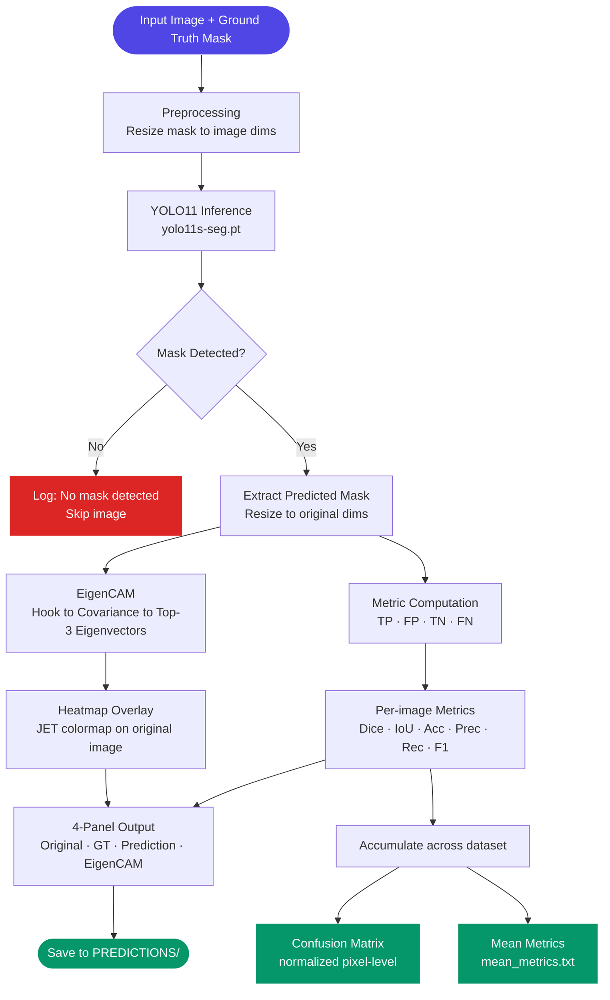
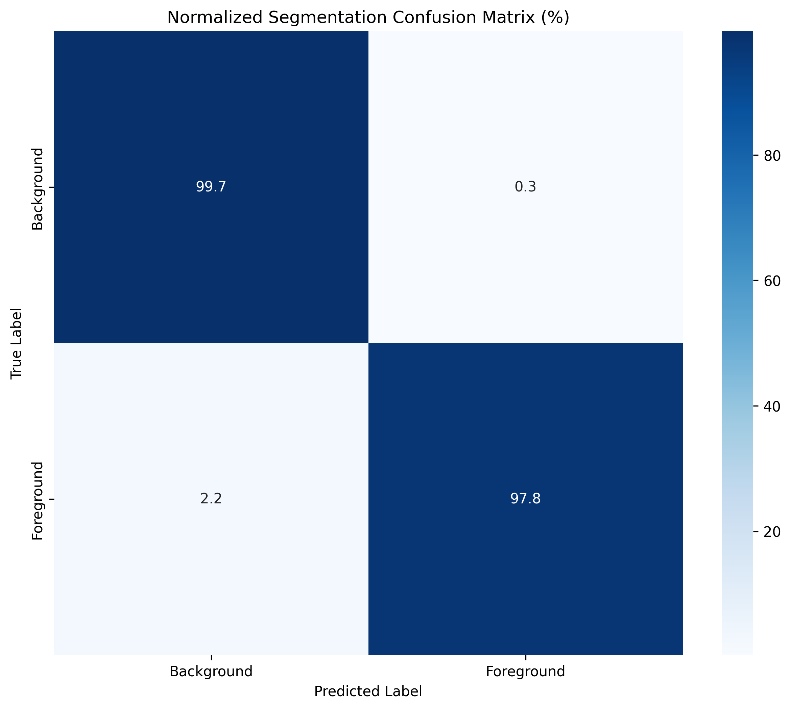

# 🧠 YOLO11-based Brachial Plexus Segmentation with Explainable AI


> **One-liner:** An instance segmentation pipeline that localises the brachial plexus in medical images using YOLO11, with per-prediction explainability via a custom EigenCAM implementation.

---

## 📌 Table of Contents

- [The Problem](#-the-problem)
- [Our Solution & Purpose](#-our-solution--purpose)
- [Why This Over Others](#-why-this-over-others)
- [Tech Stack](#-tech-stack)
- [System Flow](#-system-flow)
- [File Structure](#-file-structure)
- [Prerequisites](#-prerequisites)
- [Installation & Setup](#-installation--setup)
- [Usage](#-usage)
- [Configuration](#-configuration)
- [Screenshots](#-screenshots)
- [Contribution Guidelines](#-contribution-guidelines)
- [Known Limitations & Roadmap](#-known-limitations--roadmap)
- [License](#-license)

---

## 🚨 The Problem

The brachial plexus — a network of nerves running from the spine through the shoulder — is a critical anatomical structure in regional anaesthesia, orthopaedic surgery, and trauma care. Accurate, real-time segmentation of this structure from ultrasound or MRI images is essential for safe needle guidance and surgical planning. However:

**Key pain points:**
- ⚠️ **Manual annotation is slow and expert-dependent** — delineating the brachial plexus requires specialist knowledge and is a bottleneck in clinical workflows.
- ⚠️ **Existing deep learning models are black boxes** — clinicians cannot trust or audit model predictions without understanding *why* a region was segmented.
- ⚠️ **No unified evaluation standard** — most research reports only Dice or IoU in isolation, making model comparison across papers unreliable.

---

## 🎯 Our Solution & Purpose

**YOLO11-based Brachial Plexus Segmentation** is an end-to-end inference and evaluation pipeline that automatically segments the brachial plexus in medical images, with XAI-driven visual explanations attached to every prediction.

It solves the above by:
1. **YOLO11 instance segmentation** — leveraging Ultralytics' YOLO11s-seg model for fast, accurate mask prediction directly on input images.
2. **Custom EigenCAM** — a gradient-free explainability method that projects the principal components of feature activations into a spatial heatmap, showing exactly which image regions drove the prediction.
3. **Six-metric unified evaluation** — Accuracy, Precision, Recall, F1, IoU, and Dice Coefficient computed per image and aggregated across the full dataset, alongside a normalised pixel-level confusion matrix.

---

## ⚡ Why This Over Others

| Feature | This Project | U-Net (vanilla) | SAM (Meta) |
|---|:---:|:---:|:---:|
| Real-time inference speed | ✅ | ❌ | ❌ |
| Built-in XAI (EigenCAM) | ✅ | ❌ | ❌ |
| No fine-tuning required | ✅ | ❌ | ✅ |
| 6-metric unified evaluation | ✅ | ❌ | ❌ |
| Pixel-level confusion matrix | ✅ | ✅ | ❌ |
| Per-image visual output panel | ✅ | ❌ | ❌ |
| Open Source | ✅ | ✅ | ✅ |

> 💡 **The bottom line:** This is the only pipeline that pairs YOLO-speed segmentation with clinician-interpretable EigenCAM explanations and a full six-metric evaluation suite — all in a single script.

---

## 🛠 Tech Stack

### Core ML & Computer Vision

| Technology | Version | Purpose |
|---|---|---|
| Python | 3.9+ | Runtime environment |
| PyTorch | 2.0+ | Tensor operations, autograd, eigendecomposition |
| Ultralytics YOLO | 8.0+ | YOLO11 and YOLOv8 segmentation models |
| OpenCV (`cv2`) | 4.x | Image I/O, mask processing, contour drawing, heatmap overlay |
| NumPy | 1.24+ | Array operations, metric computation |
| Pillow | 10.x | Supplementary image handling |

### Evaluation & Visualisation

| Technology | Version | Purpose |
|---|---|---|
| scikit-learn | 1.3+ | Confusion matrix generation (`confusion_matrix`) |
| Matplotlib | 3.7+ | Confusion matrix plotting, figure export |
| Seaborn | 0.12+ | Heatmap styling for confusion matrix |

---

## 🔄 System Flow



### Flow Explanation

| Step | Description |
|---|---|
| **Preprocessing** | Ground truth mask is read as grayscale and resized to match input image dimensions if mismatched. |
| **YOLO11 Inference** | The raw input image is passed to `yolo11s-seg.pt`. The model returns instance masks for detected regions. |
| **Mask Detection Check** | If no masks are returned (no brachial plexus detected), the image is skipped and logged. |
| **Mask Extraction** | The first predicted mask is taken, resized to the original image resolution, and converted to a 0–255 uint8 array. |
| **EigenCAM** | A forward hook captures activations from `model.model.model[-3]`. The covariance matrix of activations is decomposed; the top-3 eigenvectors (weighted by eigenvalues) are projected back to spatial dimensions and normalised to [0, 1]. |
| **Metric Computation** | TP/FP/TN/FN are computed pixel-wise against the ground truth mask. Six metrics are derived from these counts. |
| **4-Panel Output** | A composite image is assembled: original image, ground truth overlay (with contours), prediction overlay (with contours), and EigenCAM heatmap blended at 40% opacity. Metrics are printed in a header panel above. |
| **Dataset Aggregation** | All per-image metrics and masks are accumulated. A normalised confusion matrix is generated across all pixel predictions. Mean metrics are written to `mean_metrics.txt`. |

---

## 📁 File Structure

```
YOLO11-based-Brachial-Plexus-Segmentation-with-Explainable-AI/
│
├── IMAGES/                             # Input medical images (.png)
│   └── *.png                           # One file per case, named consistently
│
├── MASKS/                              # Ground truth binary segmentation masks
│   └── *_mask.png                      # Must match: <image_name>_mask.png
│
├── PREDICTIONS/                        # All outputs written here (auto-created)
│   ├── *_combined_output.png           # 4-panel visualisation per image
│   ├── confusion_matrix.png            # Normalised pixel-level confusion matrix
│   └── mean_metrics.txt                # Aggregated metrics across all images
│
├── YOLO11.py                           # Primary script — YOLO11s-seg + full evaluation
├── YOLOV8                              # Baseline script — YOLOv8n-seg (Dice + IoU only)
│
├── confusion_matrix.png                # Top-level copy of confusion matrix output
├── mean_metrics.txt                    # Top-level copy of mean metrics output
│
├── LICENSE                             # MIT License
└── README.md                           # This file
```

> 📝 **Note:** `IMAGES/`, `MASKS/`, and `PREDICTIONS/` are runtime directories and are not committed to the repository. Add them to `.gitignore`. The model weights (`yolo11s-seg.pt`, `yolov8n-seg.pt`) are downloaded automatically by Ultralytics on first run.

---

## 🧰 Prerequisites

Ensure the following are installed before proceeding:

| Requirement | Minimum Version | Check Command | Download |
|---|---|---|---|
| Python | 3.9 | `python --version` | [python.org](https://python.org) |
| pip | 21.x | `pip --version` | Bundled with Python |
| Git | 2.x | `git --version` | [git-scm.com](https://git-scm.com) |
| CUDA *(optional)* | 11.8+ | `nvcc --version` | [developer.nvidia.com](https://developer.nvidia.com/cuda-downloads) |

> ⚠️ **GPU Note:** CUDA is optional but strongly recommended for processing large datasets. CPU inference is supported but significantly slower. Tested on macOS 14+ (CPU) and Ubuntu 22.04 (CUDA 12.1).

---

## 🚀 Installation & Setup

### 1. Clone the Repository

```bash
git clone https://github.com/MNADITYA05/YOLO11-based-Brachial-Plexus-Segmentation-with-Explainable-AI.git
cd YOLO11-based-Brachial-Plexus-Segmentation-with-Explainable-AI
```

### 2. Create a Virtual Environment

```bash
python -m venv venv
source venv/bin/activate        # macOS / Linux
# venv\Scripts\activate         # Windows
```

### 3. Install Dependencies

```bash
pip install ultralytics opencv-python numpy torch torchvision \
            pillow seaborn matplotlib scikit-learn
```

> 🔥 **GPU users:** Replace `torch torchvision` with the CUDA-enabled build from [pytorch.org](https://pytorch.org/get-started/locally/).

### 4. Prepare Your Dataset

```
IMAGES/
  case001.png
  case002.png
  ...
MASKS/
  case001_mask.png
  case002_mask.png
  ...
```

Mask filenames must follow the convention `<image_name>_mask.png` exactly.

### 5. Run the Pipeline

```bash
python YOLO11.py
```

Model weights (`yolo11s-seg.pt`) are downloaded automatically on first run.

### 6. Verify Output

```
✅ PREDICTIONS/ directory created
✅ Per-image *_combined_output.png files generated
✅ confusion_matrix.png saved
✅ mean_metrics.txt saved
```

---

## 💡 Usage

### Running the YOLO11 Pipeline (recommended)

```bash
python YOLO11.py
```

This runs the full pipeline: inference → EigenCAM → metric computation → 4-panel output → confusion matrix → mean metrics.

### Running the YOLOv8 Baseline

```bash
python YOLOV8
```

Runs the lighter YOLOv8n-seg baseline. Outputs Dice and IoU per image only — no confusion matrix, no mean metrics aggregation.

### Common Operations

| Action | Command |
|---|---|
| Run YOLO11 pipeline | `python YOLO11.py` |
| Run YOLOv8 baseline | `python YOLOV8` |
| Check output metrics | `cat mean_metrics.txt` |
| Count processed images | `ls PREDICTIONS/ \| grep combined \| wc -l` |

### Expected Output (console)

```
Processed case001.png. Results saved in the output directory.
Metrics: {'accuracy': '0.9971', 'precision': '0.9123', 'recall': '0.9588', 'f1_score': '0.9350', 'iou': '0.8779', 'dice_coeff': '0.9350'}
...
Confusion matrix generated and saved.
Mean metrics saved to PREDICTIONS/mean_metrics.txt

Mean Metrics Summary:
accuracy: 0.9967
precision: 0.9049
...
```

---

## ⚙️ Configuration

All paths and settings are currently hardcoded at the top of each script. Modify these directly before running:

| Variable | Location | Default | Description |
|---|:---:|---|---|
| `image_dir` | `YOLO11.py` line 14 | `'IMAGES'` | Directory containing input images |
| `mask_dir` | `YOLO11.py` line 15 | `'MASKS'` | Directory containing ground truth masks |
| `output_dir` | `YOLO11.py` line 16 | `'PREDICTIONS'` | Directory where all outputs are saved |
| Model weights | `YOLO11.py` line 20 | `'yolo11s-seg.pt'` | YOLO model variant to load |
| `target_layer` | `EigenCAM.__init__` | `model.model.model[-3]` | Layer hooked for EigenCAM activations |
| `k` (EigenCAM) | `get_eigencam()` | `min(3, ...)` | Number of top eigenvectors used |
| `alpha` (blend) | `preprocess_image()` | `0.5` | Opacity of mask overlay on input image |

> 📋 **Roadmap note:** These will be migrated to a `config/yolo11.yaml` file in an upcoming refactor. See [Roadmap](#-known-limitations--roadmap).

---

## 🖼 Screenshots

| Output | Preview |
|---|---|
| Pixel-level Confusion Matrix (2,330 images) |  |

**Sample 4-panel output per image** (saved in `PREDICTIONS/`):

| Panel | Content |
|---|---|
| Original | Raw input image |
| Ground Truth | Original image with GT mask region and contour |
| Prediction | Original image with predicted mask region and contour |
| EigenCAM | Original image blended with JET heatmap showing model attention |

---

## 🤝 Contribution Guidelines

Contributions of all kinds are welcome — bug fixes, new features, documentation improvements, and more.

### Getting Started

1. **Fork** the repository
2. **Create** a branch from `main`:
   ```bash
   git checkout -b feat/your-feature-name
   # or
   git checkout -b fix/your-bug-description
   ```
3. **Make** your changes with clear, atomic commits
4. **Push** to your fork and open a Pull Request

### Branch Naming Convention

| Type | Pattern | Example |
|---|---|---|
| New feature | `feat/[short-description]` | `feat/training-script` |
| Bug fix | `fix/[short-description]` | `fix/data-leakage-preprocessing` |
| Documentation | `docs/[short-description]` | `docs/update-installation` |
| Refactor | `refactor/[short-description]` | `refactor/eigencam-isolation` |
| Hotfix | `hotfix/[short-description]` | `hotfix/empty-mask-crash` |

### Commit Message Format

Follow [Conventional Commits](https://www.conventionalcommits.org/):

```
<type>(scope): short description

[optional body]

[optional footer]
```

**Examples:**
```
feat(eigencam): make target layer configurable via config
fix(preprocess): separate image and mask paths to remove data leakage
refactor(metrics): extract calculate_metrics into shared module
docs(readme): add usage examples and configuration table
```

### Pull Request Checklist

Before submitting a PR, confirm:
- [ ] Code runs end-to-end without errors on a sample dataset
- [ ] No hardcoded absolute paths introduced
- [ ] Docstrings added for new functions
- [ ] Output files are not committed (add to `.gitignore` if needed)
- [ ] PR description clearly explains *what* changed and *why*

> 💬 For major changes (new model, restructure, new XAI method), open an issue first to discuss the approach before investing time in implementation.

---

## 🛤 Known Limitations & Roadmap

### Current Limitations

- ⚠️ **Hardcoded paths** — `image_dir`, `mask_dir`, `output_dir`, and model weights are set directly in code, not via config or CLI.
- ⚠️ **No training pipeline** — the project uses pretrained YOLO weights with no domain-specific fine-tuning on brachial plexus data.
- ⚠️ **No CLI interface** — the script must be edited to change any parameter; no `argparse` or command-line arguments exist.
- ⚠️ **Duplicate files** — `YOLO11` (no extension) is an identical copy of `YOLO11.py`; `YOLOV8` lacks a `.py` extension.
- ⚠️ **Dead code** — standalone `calculate_iou()` is defined but never called; `from PIL import Image` is imported but unused.
- ⚠️ **No unit tests** — metric functions and EigenCAM have no test coverage.

### Roadmap

| Status | Milestone | Target |
|:---:|---|---|
| ✅ Done | YOLO11 inference + mask extraction | v1.0 |
| ✅ Done | EigenCAM explainability (custom) | v1.0 |
| ✅ Done | 6-metric evaluation + confusion matrix | v1.0 |
| ✅ Done | 4-panel per-image visualisation | v1.0 |
| 🔄 In Progress | Project restructure into `src/` modules | v1.1 |
| 🔄 In Progress | Remove data leakage in preprocessing | v1.1 |
| 📋 Planned | YAML config + argparse CLI | v1.1 |
| 📋 Planned | Domain fine-tuning script (`train.py`) | v1.1 |
| 📋 Planned | Unit tests for metrics and EigenCAM | v1.1 |
| 📋 Planned | Configurable EigenCAM target layer | v1.1 |
| 💡 Exploring | GradCAM / SHAP as alternative XAI methods | v2.0 |
| 💡 Exploring | ONNX export for clinical deployment | v2.0 |

---

## 📄 License

This project is licensed under the **MIT License**.
See the [LICENSE](./LICENSE) file for full details.

---

<div align="center">

Built with ❤️ by [M N Aditya](https://github.com/MNADITYA05)

[⭐ Star this repo](https://github.com/MNADITYA05/YOLO11-based-Brachial-Plexus-Segmentation-with-Explainable-AI) · [🐛 Report a Bug](https://github.com/MNADITYA05/YOLO11-based-Brachial-Plexus-Segmentation-with-Explainable-AI/issues) · [💡 Request a Feature](https://github.com/MNADITYA05/YOLO11-based-Brachial-Plexus-Segmentation-with-Explainable-AI/issues)

</div>
